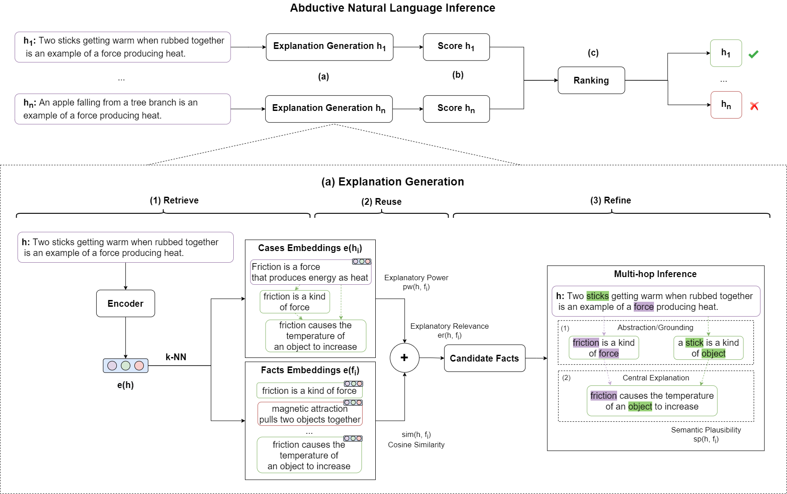

# Case-Based Abductive Natural Language Inference (Coling 2022)

Most of the contemporary approaches for multi-hop Natural Language Inference (NLI) construct explanations considering each test case in isolation. However, this paradigm is known to suffer from semantic drift, a phenomenon that causes the construction of spurious explanations leading to wrong conclusions. In contrast, this paper proposes an abductive framework for multi-hop NLI exploring the retrieve-reuse-refine paradigm in Case-Based Reasoning (CBR). Specifically, we present Case-Based Abductive Natural Language Inference (CB-ANLI), a model that addresses unseen inference problems by analogical transfer of prior explanations from similar examples. We empirically evaluate the abductive framework on commonsense and scientific question answering tasks, demonstrating that CB-ANLI can be effectively integrated with sparse and dense pre-trained encoders to improve multi-hop inference, or adopted as an evidence retriever for Transformers. Moreover, an empirical analysis of semantic drift reveals that the CBR paradigm boosts the quality of the most challenging explanations, a feature that has a direct impact on robustness and accuracy in downstream inference tasks.



# Code

Welcome! :) 

In this repository, you can find the code for the [CB-ANLI model](https://aclanthology.org/2022.coling-1.134/) presented at COLING 2022.

## Setup:

Install the [sentence-transformers](https://www.sbert.net/) package:

`pip install -U sentence-transformers`

Install the [faiss-gpu](https://pypi.org/project/faiss-gpu/) package:

`pip install faiss-gpu`

## Experiments

In this repository you can find the code for the BM25 and Sentence-BERT version presented in the paper. 

To run the models on [WorldTree](https://github.com/umanlp/tg2019task), launch the following commands:

CB-ANLI BM25:

`python ./cb_anli_bm25.py`

CB-ANLI Sentence-BERT:

`python ./cb_anli_sbert.py`

The scripts in `python ./case_base_modules/*` contain the main classes adopted to model the case-based abductive inference paradigm. 

## Citation
We hope you find this repository useful. If you use CB-ANLI in your work, please consider citing our paper!

```
@inproceedings{valentino-etal-2022-case,
    title = "Case-Based Abductive Natural Language Inference",
    author = "Valentino, Marco  and Thayaparan, Mokanarangan  and Freitas, Andr{\'e}",
    booktitle = "Proceedings of the 29th International Conference on Computational Linguistics",
    month = oct,
    year = "2022",
    address = "Gyeongju, Republic of Korea",
    publisher = "International Committee on Computational Linguistics",
    url = "https://aclanthology.org/2022.coling-1.134",
    pages = "1556--1568"
}
```

For any issues or questions, feel free to contact us at marco.valentino@idiap.ch
